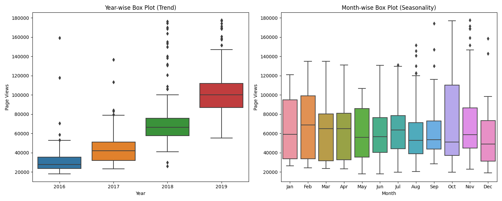

# FCC_Page_View_Time_Series_Visualizer
Page View Time Series Visualization Project for FCC Data Analysis with Python Certification

## Run Locally

1. Clone the project

```bash
  git clone https://github.com/sameeksha15/FCC_Page_View_Time_Series_Visualizer.gitt
```

2. Go to the project directory

```bash
  cd FCC_Page_View_Time_Series_Visualizer
```

3. Create virtual environment 

```bash
  python -m venv venv
```

4. Activate virtual environment

- For Windows
```bash
  .\venv\Scripts\activate
```

- For Unix
```bash
  ./venv/bin/activate
```

5. Install dependencies

```bash
  pip install -r requirements.txt
```

6. Run the script

```bash
  python main.py
```
## Dataset

- Original dataset:

|index|date|value|
|---|---|---|
|0|2016-05-09|1201|
|1|2016-05-10|2329|
|2|2016-05-11|1716|
|3|2016-05-12|10539|
|4|2016-05-13|6933|

<br/>
<br/>

- Updated Dataset:

|    | date       | value | month | year | day |
|----|------------|-------|-------|------|-----|
| 10 | 2016-05-19 | 19736 | May   | 2016 | 19  |
| 17 | 2016-05-26 | 18060 | May   | 2016 | 26  |
| 18 | 2016-05-27 | 19997 | May   | 2016 | 27  |
| 19 | 2016-05-28 | 19044 | May   | 2016 | 28  |
| 20 | 2016-05-29 | 20325 | May   | 2016 | 29  |

<br/>

## OUTPUT 

1. Line plot of "Daily freeCodeCamp Forum Page Views 5/2016-12/2019"
<br/>

[]()

<br/>
<br/>

2. Bar plot of "Average daily page views for each month"
<br/>

[]()

<br/>
<br/>

3. "Year-wise Box Plot (Trend)" and "Month-wise Box Plot (Seasonality)"
<br/>

[]()
